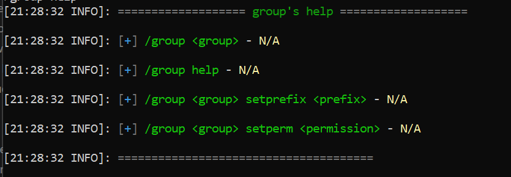
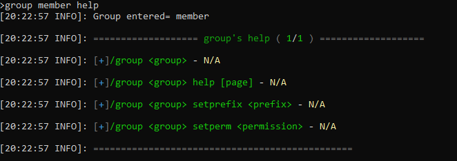

A command help is an object that is responsible for showing all the help usages of a command you make, it's easy to customize how will your help-menu will be displayed.
The `CommandHelp` requires 3 main objects so that a new instance of it can be made :
- The command being executed
- The context of the command being executed
- The detected usage that has been issued by the command-sender. <br/>
and it's created through the `Context#createCommandHelp` during the lifecycle of command-execution period, so it's not required from you to create one manually unless you know exactly what are you doing. <br/>

The `CommandHelp` object is created automatically for you, to specify a command help object in classic, just call in the execution 
`context.getContextResolvedArgument(CommandHelp.class)` or in the annotations by adding a parameter with type `CommandHelp` and it will be context resolved automatically.

## Usage
we will create a `/group <group> help` by using the annotations and you must also include a parameter of type `CommandHelp`.
The class below is an example that we will be working on using annotations:

```java
@Command("group")  
public final class GroupCommand {  

	@Usage  
	public void defaultUsage(BukkitSource source) {  
		//default execution = no args  
		source.reply("/group <group>");  
	}	

	@Usage  
	public void mainUsage(
		BukkitSource source, 
		@Named("group") @SuggestionProvider("groups") Group group
	) {  
		//when source inputs "/group <group>"  
		source.reply("entered group name= " + group.name());  
	}

	@SubCommand("help") //help usage -> /group <group> help
	public void groupHelp(  
		BukkitSource source,  
		@Named("group") Group group,  
		CommandHelp help /*context resolved parameter*/ 
	) {  
		source.reply("Group entered= " + group.name());  
		//showing help to the user
		help.display(source);  
	}
}
```
### Help template

A help template is an interface that allows you to customize how the help-menu is displayed to the command-sender, there's already a `DefaultHelpTemplate` that looks like this when you execute `/group <group> help`:

![[Pasted image 20240824143226.png]]

:::note
the `N/A` represents an unknown description, if it is annoying you, you can set a description per subcommand/usage whether using the classic way or the annotations or just make your own template which doesn't include the description in the `UsageFormatter`

:::

Any help template has 4 main components:
- Header -> the header of the menu at the top
- Footer -> the footer of the menu at the bottom
- **UsageFormatter** -> controls the formatting of each single `CommandUsage` 
- **UsageDisplayer** -> controls how the **formatted usages** are displayed together 

#### Example Help Template
Here we will be building and creating our custom help-template that will define how the help-menu is displayed, let's call it `ExampleHelpTemplate` as below :-

```java
public class ExampleHelpTemplate implements HelpTemplate {
    
    private UsageDisplayer displayer = UsageDisplayer.plain();
    private UsageFormatter formatter = new DefaultFormatter();
    
    @Override
    public String getHeader(Command<?> command) {
        return
                "&8&l&m===================&r &6"
                        + command.name() + "'s help&r &8&l&m===================";
    }
    
    
    @Override
    public String getFooter(Command<?> command) {
        return "&8&l&m=================================";
    }
    
    @Override
    public UsageFormatter getUsageFormatter() {
        return formatter;
    }
    
    @Override
    public void setUsageFormatter(UsageFormatter formatter) {
        this.formatter = formatter;
    }
    
    @Override
    public UsageDisplayer getUsagesDisplayer() {
        return displayer;
    }
    
    @Override
    public void setUsageDisplayer(UsageDisplayer displayer) {
        this.displayer = displayer;
    }
    
}
```

You can use the default `UsageFormatter` as you can see above, but it's okay to make  your own 
`UsageFormatter` instead of the `DefaultFormatter`, here's an example of
implementing your own `UsageFormatter`:-

```java
public class ExampleUsageFormatter implements UsageFormatter {
    
    
    @Override
    public <S extends Source> String formatUsageLine(Command<S> command, CommandUsage<S> usage, boolean isLast) {
        String format = "/" + CommandUsage.format(command, usage);
        return "&a" + format + " &r&l-&r &e<yellow>" + usage.description();
    }
    
}
```

Then inside of your custom help-template, you should just replace `new DefaultFormatter()` with `new ExampleUsageFormatter` *(or whatever the name of your class that implements the `UsageFormatter`)*.

:::info
UsageDisplayer has already 2 premade implementations that you should be using (unless you want to make your own implementation), which are `TreeDisplayer` and `PlainDisplayer`,  Currently, the `TreeDisplayer` is experimental and might give you some issues.
We recommend using the `PlainDisplayer` through the method `UsageDisplayer.plain()`.
:::

### Paginated Help Template

It's exactly the same as a normal `HelpTemplate` but with two extra methods :
- `int syntaxesPerPage()` -> defines how many syntax should displayed per one page 
- `String pagesHeaderComponent(int page, int maxPages)` -> controls how the pages header will be displayed as a singular part of the full header.


:::note
In `PaginatedHelpTemplate` , there's a default method that combines 2 methods to form the total header of the help-menu that will be displayed, which are:-
- `getHeader` (from the normal `HelpTemplate` interface)
- `pagesHeaderComponent()` (from the `PaginatedHelpTemplate`) which for example shows how the `%currentPage%/%max_pages%` are displayed for a `PaginatedHelpTemplate`
:::

#### Example Paginated Help Template

We will be creating our own paginated help template by creating 
a class and calling it for example `ExamplePaginatedHelpTemplate` :-

```java
public final class ExamplePaginatedHelpTemplate
        extends ExampleHelpTemplate implements PaginatedHelpTemplate {
    
    @Override
    public int syntaxesPerPage() {
        return 5;
    }
    
    @Override
    public String fullHeader(Command<?> command, int page, int maxPages) {
        return "&8&l&m===================&r &2"
                + command.name() + "'s help " + pagesHeaderComponent(page, maxPages) + "&r &8&l&m===================";
    }
    
    
    private String pagesHeaderComponent(int page, int maxPages) {
        return "&8( &a" + page + "&7/" + maxPages + " &8)";
    }
    
}
```

### Registering your help-template

We should register our help template so that it can be applied 
on any help usage(s) as the example below :

```java
dispatcher.setHelpTemplate(new ExampleHelpTemplate());
```


:::tip
You can do exactly the same for your Paginated help template 
(in this case: `ExamplePaginatedHelpTemplate`) , so for example :
`dispatcher.setHelpTemplate(new ExamplePaginatedHelpTemplate())`

:::
### Results

**Here i will show you the results of your patience and hard work for learning**
**how to create your own help displaying and customize it:-**
##### For normal help-template



##### For paginated help-template

