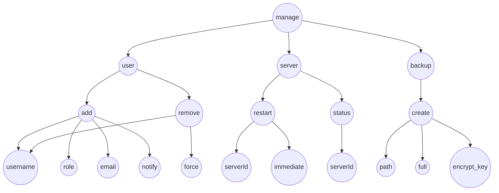

Suppose you have a root command `/manage` for a server management framework. This command has several subcommands and arguments, demonstrating advanced features and usages:-
- `/manage user add <username> <role> [--email <email>] [--notify]`
- `/manage user remove <username> [--force]`
- `/manage server restart <serverId> [--immediate]`
- `/manage server status <serverId>`
- `/manage backup create <path> [--full] [--encrypt <key>]`

**Example Input:**

- `/manage user add Alice admin --email alice@example.com --notify`
- `/manage user remove Bob --force`
- `/manage server restart 42 --immediate`
- `/manage backup create /backups/2024-06-01 --full --encrypt secretKey`

---

## Tree Visualization
Imperat creates a tree data structure for every command being registered.
Below is the visualization of the tree for the example above: 

